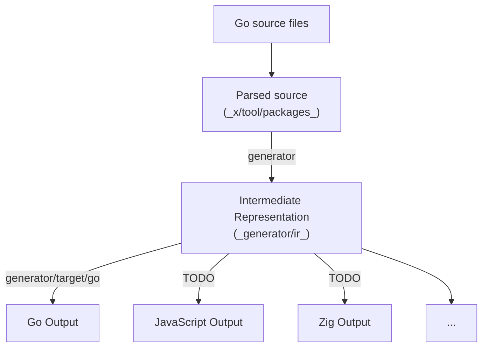

# tomino

A code-generated drop-in replacement for [amino], creating minimal 0-dependency
marshalers with no reflection. **See the [status](#status).**



## Objectives

- `< 5000` lines of non-test code, for go-targeted generation.
- Simple IR to write Amino encoders and decoders in other languages, both
  directly in Go (similarly to [generator/targets/go](./generator/targets/go),
  or by marshaling into Amino/JSON and parsing in another language.
- No reflection needed; support for interfaces using type switches on all
  possible registered types.
- Inspectable and simple generated code (one target file, no dependencies).
- Faster than Amino+Reflect and Amino+Protobuf. (And maybe, even protobuf.)
- Eventually, hand-written specifications on binary encoding, go type parsing,
  and IR (and how to build support in other languages).

We can make it happen.

## Status

This is still in very early stages, but it has some promising results (oct 5, 2024):

```
$ go test -v -run '^$' -bench . -benchmem
goos: linux
goarch: amd64
pkg: github.com/thehowl/tomino/tests
cpu: AMD Ryzen 7 7840U w/ Radeon  780M Graphics
BenchmarkMarshalers
BenchmarkMarshalers/tomino_bytes_1_000
BenchmarkMarshalers/tomino_bytes_1_000-16         	 6164292	       190.7 ns/op	    1024 B/op	       1 allocs/op
BenchmarkMarshalers/amino_bytes_1_000
BenchmarkMarshalers/amino_bytes_1_000-16          	  833690	      1302 ns/op	    2544 B/op	      19 allocs/op
BenchmarkMarshalers/tomino_bytes_1_000_000
BenchmarkMarshalers/tomino_bytes_1_000_000-16     	   12324	    129832 ns/op	 1007618 B/op	       1 allocs/op
BenchmarkMarshalers/amino_bytes_1_000_000
BenchmarkMarshalers/amino_bytes_1_000_000-16      	    4180	    277993 ns/op	 2015730 B/op	      19 allocs/op
BenchmarkMarshalers/tomino_empty
BenchmarkMarshalers/tomino_empty-16               	56545048	        21.57 ns/op	       8 B/op	       1 allocs/op
BenchmarkMarshalers/amino_empty
BenchmarkMarshalers/amino_empty-16                	 1602072	       788.8 ns/op	     528 B/op	      16 allocs/op
BenchmarkMarshalers/tomino_fixed
BenchmarkMarshalers/tomino_fixed-16               	25409233	        44.94 ns/op	      24 B/op	       2 allocs/op
BenchmarkMarshalers/amino_fixed
BenchmarkMarshalers/amino_fixed-16                	 1430749	       824.4 ns/op	     560 B/op	      18 allocs/op
BenchmarkMarshalers/tomino_ptr_-1337
BenchmarkMarshalers/tomino_ptr_-1337-16           	21260710	        52.93 ns/op	      32 B/op	       2 allocs/op
BenchmarkMarshalers/amino_ptr_-1337
BenchmarkMarshalers/amino_ptr_-1337-16            	 1636072	       751.3 ns/op	     560 B/op	      18 allocs/op
BenchmarkMarshalers/tomino_slice
BenchmarkMarshalers/tomino_slice-16               	13637137	        85.76 ns/op	      56 B/op	       3 allocs/op
BenchmarkMarshalers/amino_slice
BenchmarkMarshalers/amino_slice-16                	  764563	      1496 ns/op	    1200 B/op	      38 allocs/op
BenchmarkMarshalers/tomino_time_duration
BenchmarkMarshalers/tomino_time_duration-16       	11054844	       114.2 ns/op	     112 B/op	       4 allocs/op
BenchmarkMarshalers/amino_time_duration
BenchmarkMarshalers/amino_time_duration-16        	 1000000	      1002 ns/op	     784 B/op	      24 allocs/op
PASS
ok  	github.com/thehowl/tomino/tests	23.414s
```

These are in no way definitive results (I have been writing performant code but
not inspecting to find any specific slowness; similarly for amino, it may be
better to at least test it out with proto3 bindings). But as you can see, the
results are at the very least promising: significantly less heap allocations,
and performance improvements varying from 2x all the way up to 37x.[^1]

[^1]: the reason why these results vary greatly are because the tests where the two
encoders compare involve great amounts of allocation, due to the nature of the
underlying data. ie.: if they both have to allocate 1 megabyte, that's going to be
the slowest part for both, so the performance gains aren't that noticeable. This
is most clearly the case for the bytes_* benchmarks, which allocate a lot of
`B/op`. On the other hand, where encoder/decoder logic is heavily involved,
(and consequently, `B/op` for both is lower), tomino generally shines, with
speed improvements ranging from 10x to 25x mostly.

There still isn't a decoder. I want to try to get all the current feature-set of
amino ported over to code generating go marshalers, before starting on the
decoder, and then heading onto other languages.

If the vision with this thing succeeds, we should at the very least have a tool
to create amino marshalers/unmarshalers outside of Go. If this vision succeeds
tremendously, we might be able to replace the current usages in
[gnolang/gno](https://github.com/gnolang/gno) with this package.

## Binary encoding

Heavily drawn from [protobuf's documentation "Encoding" page](https://protobuf.dev/programming-guides/encoding/#cheat-sheet).

This section only tackles how the binary encoding of the format works. The
[Language specification][language] specifies instead how the Go specification
can be parsed to create decoders, depending on the types.

XXX: additional constraints. what does amino constrain that protobuf doesn't? i
imagine we want to make sure to make the result deterministic and to say that
ambiguities shouldn't happen; like out-of-order repeated fields, or
out-of-order fields.

### Base 128 varint

TODO: copy over section from protobuf page.

### Message structure

A message is a series of tag-value pairs. Each pair is called a "record".
The tag determines the "field number" and the "type" of the value; which in
turn determines its length.

ID | Name    | Value length
---|---------|-------------------------------------
0  | varint  | Variable (see [varint])
1  | i64     | 8 bytes
2  | len     | [varint] length N + N bytes
5  | i32     | 4 bytes

The field number and the type ID are encoded as a varint, packed together via
the formula `(field_number << 3) | type_id`.

Multiple messages with the same field_number may appear. These generally
indicate a repeated field, like a slice or array.

### Uses for scalar-type values

- varint: encodes all kind of signed and unsigned integer values, including
    booleans. "lower" unsigned values use fewer bytes.
- i64: encoding fixed-size int64 values, including float32's.
- i32: encoding fixed-size int32 values, including float64's.

### Uses for len-type values

The decoder will determine, based on the underlying language type, how to parse
the bytes. Here are common usages:

- raw bytes: useful for strings, and byte sequences.
- submessages: encodings of other messages.
- packed messages: messages of repeated values of type varint, i64 or i32, can
    have their values concatenated together and placed in a len-type value. this
    is called a "packed" message.

## Language specification

The Language specification allows to parse source code, so that it can be used
to create tomino encoders and decoders. It is the tomino's parallel to the
[protocol buffers language](https://protobuf.dev/reference/protobuf/edition-2023-spec/).

This sounds all well and good. The caveat is that tomino requires a compliant
parser of the [Go language specification](https://go.dev/ref/spec). tomino only
handles a subset; and a full compiler of the Go programming language is not
required. But your parser needs not only to be able to understand type
declarations, but also resolve references to external named types.

(Note: this may change if the idea of tomino gains traction and someone is
interested in developing a Go-compatible grammar and specification of the
importer.)

Assuming you have a working Go parser and type-checker for resolving type names,
let's get started.

An encoder and decoder may be generated for any
[type declaration](https://go.dev/ref/spec#Type_declarations).
Names are resolved, until we arrive at a

[amino]: https://github.com/gnolang/gno/tree/master/tm2/pkg/amino
[language]: #language-specification
[varint]: #base-128-varint
